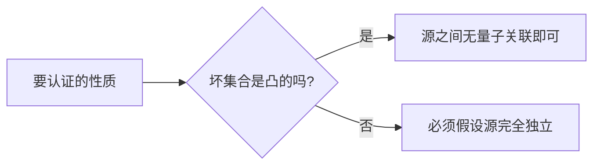

# 写作模板

每一节先给出 Markdown 源码，下面紧跟渲染效果。写新文章时，复制对应片段即可。
{ .page-lead }

## 新建一篇文章

1. 在对应板块和主题目录下新建文件，**文件名用英文或拼音**，例如 `docs/research/device-independence/self-testing-review.md`；
2. 在 `zensical.toml` 的 `nav` 里，把它加到所属主题下面；
3. 在主题首页（该目录下的 `index.md`）的卡片列表里加一张卡片；
4. 推送到 GitHub，网站会自动更新，"最后更新"时间和首页"最近更新"都会自动生成。

每篇文章开头是 front matter，标题写在第一个一级标题里（保留中文）：

```markdown title="文章开头"
---
description: 一句话简介，会显示在首页"最近更新"和搜索结果里。
tags:
  - 器件无关
  - 论文阅读
---

# 自检验综述阅读笔记

一句话副标题（可选）
{ .page-lead }
```

## 数学公式

行内公式用 `$...$`，独立公式用 `$$...$$`（单独成段）。需要编号的公式直接写 `\begin{equation}...\end{equation}`（或 `align`，**外面不要再套 `$$`**），配合 `\label` 和 `\eqref` 引用；`$$...$$` 里的公式不编号。

```latex title="公式写法"
Bell 态 $\ket{\Phi^+}=\frac{1}{\sqrt2}(\ket{00}+\ket{11})$ 的约化态是最大混态。

$$
\rho_A=\Tr_B\ket{\Phi^+}\bra{\Phi^+}=\frac{\mathbb 1}{2}
$$

\begin{equation}
  S=\langle A_0B_0\rangle+\langle A_0B_1\rangle+\langle A_1B_0\rangle-\langle A_1B_1\rangle\le 2
  \label{eq:chsh}
\end{equation}

量子力学允许的最大值是 $2\sqrt2$，即式 $\eqref{eq:chsh}$ 的 Tsirelson 界。

\begin{align}
  p(ab|xy) &= \Tr\big[\rho\,(M_{a|x}\otimes N_{b|y})\big] \label{eq:born}\\
  \sum_b p(ab|xy) &= \Tr\big[\rho\,(M_{a|x}\otimes\mathbb 1)\big]
\end{align}
```

Bell 态 $\ket{\Phi^+}=\frac{1}{\sqrt2}(\ket{00}+\ket{11})$ 的约化态是最大混态。

$$
\rho_A=\Tr_B\ket{\Phi^+}\bra{\Phi^+}=\frac{\mathbb 1}{2}
$$

\begin{equation}
  S=\langle A_0B_0\rangle+\langle A_0B_1\rangle+\langle A_1B_0\rangle-\langle A_1B_1\rangle\le 2
  \label{eq:chsh}
\end{equation}

量子力学允许的最大值是 $2\sqrt2$，即式 $\eqref{eq:chsh}$ 的 Tsirelson 界。

\begin{align}
  p(ab|xy) &= \Tr\big[\rho\,(M_{a|x}\otimes N_{b|y})\big] \label{eq:born}\\
  \sum_b p(ab|xy) &= \Tr\big[\rho\,(M_{a|x}\otimes\mathbb 1)\big]
\end{align}

!!! tip "预定义的宏"
    `\ket{ψ}`、`\bra{ψ}`、`\braket{φ}{ψ}`、`\Tr` 已经在 `docs/javascripts/mathjax.js` 里定义好，可以直接用。表格里的竖线请写成 `\vert` 或 `\mid`，否则会被当成表格分隔符。

## 提示框

六种学术提示框，颜色各不相同。`!!!` 是展开的，`???` 是默认折叠的，`???+` 是可折叠但默认展开。**标题请始终写上**（写在引号里），否则会显示英文类型名。

````markdown title="提示框写法"
!!! definition "定义 1（$k$-producible）"
    一个 $n$ 体纯态称为 $k$-producible，如果它能写成若干个至多 $k$ 体的纯态的张量积。

!!! theorem "定理 2（Tsirelson 界）"
    对任意量子态和二值观测量，CHSH 表达式满足 $S\le 2\sqrt2$。

??? proof "证明"
    令 $\mathcal B=A_0\otimes(B_0+B_1)+A_1\otimes(B_0-B_1)$，
    计算 $\mathcal B^2$ 并用算符范数估计即得。

!!! example "例题 3"
    计算 $\ket{\Phi^+}$ 在最优测量下的 CHSH 值。

!!! warning "注意"
    违背 Bell 不等式只证明了不可分，不能说明态就是 $\ket{\Phi^+}$。

???+ summary "总结"
    DI 结论只依赖概率表 $P$，但几乎总是关于设备内部的结论。
````

!!! definition "定义 1（$k$-producible）"
    一个 $n$ 体纯态称为 $k$-producible，如果它能写成若干个至多 $k$ 体的纯态的张量积。

!!! theorem "定理 2（Tsirelson 界）"
    对任意量子态和二值观测量，CHSH 表达式满足 $S\le 2\sqrt2$。

??? proof "证明"
    令 $\mathcal B=A_0\otimes(B_0+B_1)+A_1\otimes(B_0-B_1)$，
    计算 $\mathcal B^2$ 并用算符范数估计即得。

!!! example "例题 3"
    计算 $\ket{\Phi^+}$ 在最优测量下的 CHSH 值。

!!! warning "注意"
    违背 Bell 不等式只证明了不可分，不能说明态就是 $\ket{\Phi^+}$。

???+ summary "总结"
    DI 结论只依赖概率表 $P$，但几乎总是关于设备内部的结论。

此外还可以用 `lemma`、`corollary`、`proposition`（与定理同色）、`note`、`tip`、`danger` 等类型。

## PDF 嵌入

PDF 和它的介绍页放在同一个目录、用同一个英文文件名，例如 `crypto-quant-trading.md` 和 `crypto-quant-trading.pdf`。下面这段会生成"桌面端内嵌阅读 + 下载按钮"，手机上自动隐藏阅读框、只保留按钮。

!!! tip "路径怎么写"
    按钮链接和 `<iframe>` 的 `src` 都**直接写 PDF 文件名**（相对于当前 `.md` 文件），构建时会自动换算成网页上的正确路径。

```html title="PDF 嵌入写法"
<div class="fl-pdf" markdown>
<div class="fl-pdf__bar" markdown>
<p class="fl-pdf__name" markdown="span">:lucide-file-text: 文件标题 <small>PDF · 20 页</small></p>
<p class="fl-pdf__actions" markdown>[:lucide-external-link: 新标签打开](my-notes.pdf){ .md-button target="_blank" rel="noopener" } [:lucide-download: 下载 PDF](my-notes.pdf){ .md-button .md-button--primary download }</p>
</div>
<iframe class="fl-pdf__frame" src="my-notes.pdf#view=FitH" title="文件标题" loading="lazy"></iframe>
<p class="fl-pdf__mobile">手机浏览器对内嵌 PDF 的支持有限，建议下载或在新标签页中打开。</p>
</div>
```

实际效果见 [加密货币交易：从零到量化](../interests/quant-trading/crypto-quant-trading.md)。PDF 里的文字不会进入站内搜索，所以介绍页里最好写上摘要和章节目录。

## 标签

在 front matter 的 `tags` 里列出标签，页面底部会显示这些标签，点击即可跳到 [标签索引](../tags.md)，搜索框里也能直接搜标签名。

```yaml title="front matter"
tags:
  - 器件无关
  - 研究总结
```

常用标签见仓库根目录 `CLAUDE.md` 里的标签表，尽量复用已有标签，不要造近义词。

## 代码块

代码块右上角自带一键复制。可以加标题、行号和高亮行：

````markdown title="代码块写法"
```python title="kelly.py" linenums="1" hl_lines="4 5"
def kelly_fraction(p: float, b: float) -> float:
    """胜率 p、赔率 b 时的 Kelly 最优仓位比例。"""
    q = 1 - p
    f = (b * p - q) / b
    return max(f, 0.0)
```
````

```python title="kelly.py" linenums="1" hl_lines="4 5"
def kelly_fraction(p: float, b: float) -> float:
    """胜率 p、赔率 b 时的 Kelly 最优仓位比例。"""
    q = 1 - p
    f = (b * p - q) / b
    return max(f, 0.0)
```

行内代码高亮：`#!python print("hello")`。

## 脚注

```markdown title="脚注写法"
CHSH 不等式最早由 Clauser 等人提出[^chsh]。

[^chsh]: J. F. Clauser, M. A. Horne, A. Shimony, R. A. Holt, *PRL* **23**, 880 (1969).
```

CHSH 不等式最早由 Clauser 等人提出[^chsh]。鼠标悬停在脚注编号上可以直接预览。

[^chsh]: J. F. Clauser, M. A. Horne, A. Shimony, R. A. Holt, *PRL* **23**, 880 (1969).

## 内容选项卡

```markdown title="选项卡写法"
=== "Python"

    ```python
    import numpy as np
    returns = np.diff(np.log(prices))
    ```

=== "公式"

    $$r_t=\ln P_t-\ln P_{t-1}$$
```

=== "Python"

    ```python
    import numpy as np
    returns = np.diff(np.log(prices))
    ```

=== "公式"

    $$r_t=\ln P_t-\ln P_{t-1}$$

## Mermaid 图表

````markdown title="Mermaid 写法"

````


## 其他常用写法

| 效果 | 写法 |
|---|---|
| ==高亮== | `==高亮==` |
| ~~删除线~~ | `~~删除线~~` |
| 上标 x^2^、下标 H~2~O | `x^2^`、`H~2~O` |
| 按键 ++ctrl+c++ | `++ctrl+c++` |
| 图标 :lucide-atom: | `:lucide-atom:` |
| 站内链接 | `[标签索引](../tags.md)`（写 `.md` 相对路径，构建时会检查是否失效） |
| 图片 | ``，图片放在文章同目录的 `images/` 下 |

- [x] 任务列表
- [ ] 也可以用
