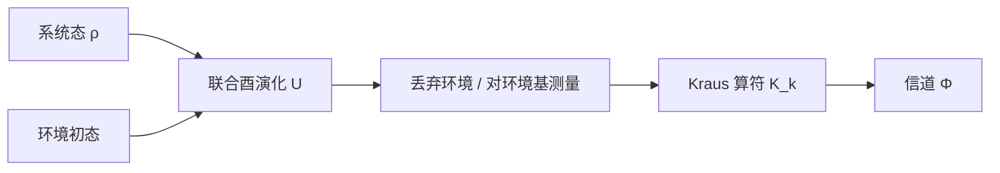

# Kraus 算符：量子操作的算符和表示

一句话回答：一个物理上合法的量子态变换，到底长什么样？
{ .page-lead }

!!! keypoints "要点"
    - Kraus 算符 $\{K_k\}$ 把任意线性、完全正（CP）的态变换写成 $\Phi(\rho)=\sum_k K_k\rho K_k^\dagger$，保迹等价于 $\sum_k K_k^\dagger K_k=\mathbb 1$。
    - 它的起点是**测量引起的状态更新**（Hellwig–Kraus 的“纯操作”），而不是开放系统；后来才被发现与环境耦合的 Stinespring 图像完全等价。
    - 三种等价说法：映射 CP $\Leftrightarrow$ Choi 矩阵半正定 $\Leftrightarrow$ 存在 Kraus 表示；Kraus 秩就是 Choi 矩阵的秩。
    - Kraus 表示**不唯一**：两组 Kraus 算符给出同一映射，当且仅当它们之间差一个等距（酉）混合。
    - 应用覆盖开放系统与 Lindblad 方程、广义测量与量子仪器、量子纠错、过程层析、信道优化（SDP）以及相干性/纠缠的资源理论。

## 1. 问题从哪来

孤立系统的演化是酉的：$\rho\mapsto U\rho U^\dagger$。但现实里我们面对的几乎总是**子系统**：它和环境耦合、被测量、被丢弃一部分……此时 $\rho\mapsto\rho'$ 这种变换应该满足什么条件？

一个合理的清单是：

1. **线性**：对混合态的制备方式不敏感，$\Phi(p\rho_1+(1-p)\rho_2)=p\Phi(\rho_1)+(1-p)\Phi(\rho_2)$；
2. **保持正性并保迹**（若是确定性过程）：输出仍是密度矩阵；
3. **完全正（CP）**：对任意额外的、与系统无关的辅助系统 $R$，$\mathrm{id}_R\otimes\Phi$ 仍然把态映到态。

第 3 条是关键。只要求“正”是不够的：转置映射 $\rho\mapsto\rho^{T}$ 是正的，但作用在纠缠态的一半上会产生负本征值，所以它不是物理操作（见第 5 节的例子）。

**Kraus 定理回答的就是：满足上面这些条件的映射，恰好就是能写成 $\sum_k K_k\rho K_k^\dagger$ 的那些。** 于是“任意物理变换”被压缩成了“一组算符”。

## 2. 历史由来

!!! note "名字的混乱"
    同一个结构在文献里有很多名字：Kraus 表示、算符和表示（operator-sum representation）、Kraus–Stinespring–Sudarshan 表示等。Nielsen–Chuang 的教材里把 $K_k$ 叫作“操作元”（operation elements）。这不是巧合：它确实是由多条独立线索汇合出来的。

| 年份 | 人物 | 贡献 |
|---|---|---|
| 1955 | Stinespring | 证明 C\*-代数上完全正映射的**膨胀定理**：CP 映射等于“嵌入更大空间 + 压缩” |
| 1961 | Sudarshan、Mathews、Rau | 研究有限能级系统最一般的动力学映射，已得到算符和形式，但当时没有“完全正”的概念，论证里有缺口（用到的矩阵只是块正而非正） |
| 1968–1970 | Hellwig、Kraus | 在 Marburg 研究“纯操作”与测量：纯操作对应范数不超过 1 的算符 $A$，而 $F=A^\dagger A$ 是量子“效应” |
| 1971 | Kraus | 《General state changes in quantum theory》，把一般的态变换（操作）系统化为密度矩阵上的线性映射，并给出算符和表示 |
| 1972 | Jamiołkowski | 映射与算符之间的对应（Choi–Jamiołkowski 同构的一部分） |
| 1975 | Choi | 《Completely positive linear maps on complex matrices》，用有限维矩阵给出 CP 的完整刻画与简洁证明 |
| 1976 | Gorini–Kossakowski–Sudarshan；Lindblad | 完全正动力学半群的生成元，即 GKLS（Lindblad）方程 |
| 1983 | Kraus | 专著《States, Effects, and Operations》，把态、效应、操作作为量子理论的基本概念整理成体系 |
| 1990s | 量子信息 | Schumacher、Nielsen–Chuang 等把它变成量子信道、纠错、层析的标准语言 |

这里有几点值得记住：

- **Kraus 的原始语境是测量与量子场论。** “操作”一词承自 Haag–Kastler，指外部干预（如测量）引起的态变换；Hellwig–Kraus 的论文里，操作由系统与仪器的相互作用（一个 $S$ 矩阵）产生。因此 $K_k$ 最初就是“测得结果 $k$ 时的状态更新算符”。
- **更早的版本其实存在。** Sudarshan 等人 1961 年的论文已经含有算符和形式，只是当时没有区分“正”与“完全正”。这也是为什么有些文献称之为 Kraus–Sudarshan 表示。
- **数学上的根在 Stinespring。** 在有限维下，Kraus 表示、Choi 矩阵和 Stinespring 膨胀本质上是同一个事实的三种写法（第 4 节）。
- **关于 Karl Kraus 本人**：德国理论物理学家（1938–1988），工作于 Marburg 和 Würzburg 大学，英年早逝，留下的核心遗产就是上面这套“态、效应、操作”的语言。

## 3. 严格定义

设 $\mathcal H_A,\mathcal H_B$ 为有限维 Hilbert 空间，$\mathcal B(\mathcal H)$ 为其上的线性算符空间。

!!! definition "定义 1（量子操作与量子信道）"
    线性映射 $\Phi:\mathcal B(\mathcal H_A)\to\mathcal B(\mathcal H_B)$ 称为**完全正（CP）**的，如果对任意 $n$，$\mathrm{id}_n\otimes\Phi$ 都把半正定算符映为半正定算符。
    CP 且**迹不增**（$\Tr\Phi(\rho)\le\Tr\rho$）的映射称为**量子操作**；CP 且**保迹**（TP）的映射称为**量子信道**。

!!! theorem "定理 2（Kraus 表示定理）"
    对线性映射 $\Phi:\mathcal B(\mathcal H_A)\to\mathcal B(\mathcal H_B)$，下列条件等价：

    1. $\Phi$ 是完全正的；
    2. Choi 矩阵 $J(\Phi)=\sum_{i,j}\ket{i}\bra{j}\otimes\Phi(\ket{i}\bra{j})$ 半正定；
    3. 存在算符 $K_k:\mathcal H_A\to\mathcal H_B$（称为 **Kraus 算符**），使得
    \begin{equation}
      \Phi(X)=\sum_{k}K_k\,X\,K_k^\dagger .
      \label{eq:kraus}
    \end{equation}

    此外，$\Phi$ 保迹当且仅当 $\sum_kK_k^\dagger K_k=\mathbb 1_A$；迹不增当且仅当 $\sum_kK_k^\dagger K_k\le\mathbb 1_A$。

??? proof "证明思路（2 ⇒ 3，3 ⇒ 1 显然）"
    **3 ⇒ 1**：对任意 $n$，$(\mathrm{id}_n\otimes\Phi)(Y)=\sum_k(\mathbb 1\otimes K_k)\,Y\,(\mathbb 1\otimes K_k)^\dagger$，当 $Y\ge0$ 时每一项都半正定。

    **2 ⇒ 3**：记 $\ket{\Omega}=\sum_i\ket{i}\ket{i}$，则 $J(\Phi)=(\mathrm{id}\otimes\Phi)(\ket\Omega\bra\Omega)$，并且
    $$
    \Phi(X)=\Tr_A\big[(X^{T}\otimes\mathbb 1)\,J(\Phi)\big].
    $$
    $J\ge0$，所以可做谱分解 $J=\sum_k\ket{v_k}\bra{v_k}$（本征值已吸收进 $\ket{v_k}$）。把每个 $\ket{v_k}$ 写成
    $\ket{v_k}=\sum_i\ket{i}\otimes K_k\ket{i}$，这就**定义**了 $K_k$。代入得
    $$
    J=\sum_{i,j}\ket i\bra j\otimes\sum_kK_k\ket i\bra jK_k^\dagger ,
    $$
    即 $\Phi(\ket i\bra j)=\sum_kK_k\ket i\bra jK_k^\dagger$，由线性性得式 $\eqref{eq:kraus}$。

    **保迹条件**：$\Tr\Phi(X)=\Tr\big[\sum_kK_k^\dagger K_k\,X\big]$ 对所有 $X$ 成立，当且仅当 $\sum_kK_k^\dagger K_k=\mathbb 1$。

### 3.1 与环境的关系（Stinespring 图像）

设环境初态为纯态 $\ket{0}_E$，系统与环境经酉算符 $U$ 作用后丢弃环境：

$$
\Phi(\rho)=\Tr_E\big[U(\rho\otimes\ket0\bra0_E)U^\dagger\big].
$$

在环境的某组正交基 $\{\ket{k}_E\}$ 下展开，立刻得到 Kraus 算符

$$
K_k=(\mathbb 1\otimes\bra{k}_E)\,U\,(\mathbb 1\otimes\ket{0}_E).
$$

反过来，任意一组满足 $\sum K_k^\dagger K_k=\mathbb 1$ 的 $\{K_k\}$，都可以定义等距 $V\ket\psi=\sum_kK_k\ket\psi\otimes\ket{k}_E$ 而得到这样的环境模型（环境维数取 Kraus 算符个数即可）。



!!! tip "怎么理解 Kraus 指标 $k$"
    $k$ 是“环境里留下的记录”：不看环境，就把所有 $k$ 加起来，得到信道；读出了环境，就得到一个确定的 $k$，系统被更新为 $K_k\rho K_k^\dagger/p_k$。同一个信道可以有不同的“读出方式”，这正是下面非唯一性的物理含义。

### 3.2 重要性质

**非唯一性（酉自由度）。** 两组 Kraus 算符 $\{K_i\}$ 与 $\{L_j\}$（不足的一组用零算符补齐）给出同一映射，当且仅当存在酉矩阵 $u$ 使得 $K_i=\sum_ju_{ij}L_j$。

**Kraus 秩。** 最少需要的 Kraus 算符个数等于 Choi 矩阵的秩，且 $\le d_Ad_B$。Choi 矩阵的谱分解给出一组满足 $\Tr(K_i^\dagger K_j)\propto\delta_{ij}$ 的**典范 Kraus 算符**。酉信道的 Kraus 秩是 1。

**对偶（Heisenberg 图像）。** $\Phi^\dagger(A)=\sum_kK_k^\dagger AK_k$；$\Phi$ 保迹等价于 $\Phi^\dagger$ 保单位元，而 $\Phi$ 为**幺正保持**（unital，$\Phi(\mathbb 1)=\mathbb 1$）对应的是另一个条件 $\sum_kK_kK_k^\dagger=\mathbb 1$。

**复合与张量积。** 信道级联时 Kraus 算符相乘：$\{L_jK_i\}$；两个独立信道并行时是 $\{K_i\otimes L_j\}$。

**与 POVM 的关系。** 若 $K_k$ 是测得结果 $k$ 时的更新算符，则

\begin{equation}
  p_k=\Tr\big(K_k\rho K_k^\dagger\big)=\Tr(E_k\rho),\qquad E_k=K_k^\dagger K_k,\qquad\sum_kE_k=\mathbb 1.
  \label{eq:povm}
\end{equation}

POVM 元只决定 $K_k$ 的“模”：由极分解，$K_k=W_k\sqrt{E_k}$，$W_k$ 是任意酉（或等距）算符。取 $W_k=\mathbb 1$ 就是 Lüders 规则。**所以 POVM 并不决定测量后的态，Kraus 算符（量子仪器）才决定。**

### 3.3 同一个映射的几种写法

| 表示 | 形式 | 突出什么 |
|---|---|---|
| Kraus 表示 | $\Phi(\rho)=\sum_kK_k\rho K_k^\dagger$ | 物理直观，易于计算 |
| Choi 矩阵 | $J(\Phi)\ge0$，$\Tr_BJ=\mathbb 1_A$（保迹） | CP 和 TP 都变成线性矩阵不等式，适合 SDP |
| Stinespring 膨胀 | $\Phi(\rho)=\Tr_E[V\rho V^\dagger]$ | 与环境、互补信道的联系 |
| 过程矩阵 $\chi$ | $\Phi(\rho)=\sum_{m,n}\chi_{mn}E_m\rho E_n^\dagger$ | 在固定算符基（如 Pauli 基）下做层析 |
| 转移矩阵 | $\mathrm{vec}\,\Phi(\rho)=\hat\Phi\,\mathrm{vec}\,\rho$ | 级联就是矩阵乘法 |

## 4. 例子

!!! example "例题 3（单比特常见信道）"
    - **比特翻转**：$K_0=\sqrt{1-p}\,\mathbb 1$，$K_1=\sqrt p\,X$。
    - **去极化**：$K_0=\sqrt{1-3p/4}\,\mathbb 1$，$K_{i}=\sqrt{p/4}\,\sigma_i$（$i=x,y,z$），作用为 $\rho\mapsto(1-p)\rho+p\,\mathbb 1/2$。
    - **相位阻尼**：$K_0=\mathrm{diag}(1,\sqrt{1-\lambda})$，$K_1=\mathrm{diag}(0,\sqrt\lambda)$，只衰减非对角元（退相干）。
    - **振幅阻尼**（自发辐射）：
    $$
    K_0=\begin{pmatrix}1&0\\0&\sqrt{1-\gamma}\end{pmatrix},\qquad
    K_1=\begin{pmatrix}0&\sqrt{\gamma}\\0&0\end{pmatrix}=\sqrt\gamma\,\ket0\bra1 .
    $$
    $K_1$ 是“跳跃”：把 $\ket1$ 变成 $\ket0$；$K_0$ 是“无跳跃”的无声演化，使 $\ket1$ 的振幅缓慢衰减。

    验证保迹：$K_0^\dagger K_0+K_1^\dagger K_1=\mathrm{diag}(1,1-\gamma)+\mathrm{diag}(0,\gamma)=\mathbb 1$。

!!! example "例题 4（为什么转置不是物理操作）"
    转置映射 $T(\rho)=\rho^{T}$ 对单比特是正的，但它的 Choi 矩阵恰好是 SWAP 算符，有本征值 $-1$。把 $T$ 作用到最大纠缠态 $\ket{\Phi^+}$ 的一半上，会得到有负本征值的算符。因此 $T$ 不是 CP，没有 Kraus 表示。这也是 PPT 判据检验纠缠的原理。

下面的代码验证了：振幅阻尼的 Choi 矩阵半正定、Kraus 秩为 2；从 Choi 矩阵重新提取出的**另一组**正交 Kraus 算符作用相同。

```python title="kraus_demo.py" linenums="1"
import numpy as np

def apply(kraus, rho):
    """Φ(ρ) = Σ_k K_k ρ K_k†"""
    return sum(K @ rho @ K.conj().T for K in kraus)

def choi(kraus):
    """J(Φ) = Σ_ij |i><j| ⊗ Φ(|i><j|) = Σ_k |K_k>><<K_k|"""
    vecs = [K.T.reshape(-1) for K in kraus]     # |K>> = Σ_i |i> ⊗ K|i>
    return sum(np.outer(v, v.conj()) for v in vecs)

def choi_to_kraus(J, dA, dB, tol=1e-12):
    """J 的谱分解给出一组正交（典范）Kraus 算符"""
    w, V = np.linalg.eigh(J)
    return [np.sqrt(l) * V[:, k].reshape(dA, dB).T
            for k, l in enumerate(w) if l > tol]

g = 0.3
K0 = np.array([[1, 0], [0, np.sqrt(1 - g)]])
K1 = np.array([[0, np.sqrt(g)], [0, 0]])
kraus = [K0, K1]

J = choi(kraus)
print("保迹:", np.allclose(sum(K.conj().T @ K for K in kraus), np.eye(2)))
print("Choi 半正定:", np.linalg.eigvalsh(J).min() > -1e-12)
print("Kraus 秩:", np.linalg.matrix_rank(J))

kraus2 = choi_to_kraus(J, 2, 2)
rho = np.array([[0.5, 0.5], [0.5, 0.5]])
print("两组 Kraus 作用一致:", np.allclose(apply(kraus, rho), apply(kraus2, rho)))
```

## 5. 作用与应用

### 5.1 开放系统动力学与 Lindblad 方程

取很短的时间步 $\mathrm{d}t$，把 Kraus 算符按 $\mathrm{d}t$ 的阶数展开：一个“无跳跃”项和若干“跳跃”项，

$$
K_0=\mathbb 1-\Big(iH+\tfrac12\sum_{k\ge1}L_k^\dagger L_k\Big)\mathrm{d}t,\qquad
K_k=L_k\sqrt{\mathrm{d}t}\quad(k\ge1).
$$

代入 $\rho+\mathrm{d}\rho=\sum_kK_k\rho K_k^\dagger$ 并保留到 $\mathrm{d}t$ 阶，得

$$
\dot\rho=-i[H,\rho]+\sum_{k}\Big(L_k\rho L_k^\dagger-\tfrac12\{L_k^\dagger L_k,\rho\}\Big),
$$

这就是 **GKLS（Lindblad）主方程**。反过来，它的解在每个时刻都是 CP 信道，这就是 Gorini–Kossakowski–Sudarshan 与 Lindblad 1976 年的结论。

由此还得到 **量子跳跃 / 量子轨迹**方法：把 $K_k$ 当作随机事件（探测到一个光子之类），沿着轨迹演化纯态，再对轨迹求平均。**同一个主方程可以有不同的“展开”（unraveling），正是 Kraus 表示的酉自由度的体现。**

### 5.2 广义测量与量子仪器

给定测量，每个结果 $k$ 对应一个 Kraus 算符（或一个完全正的“子操作”）：

- 概率 $p_k=\Tr(K_k\rho K_k^\dagger)$，后验态 $K_k\rho K_k^\dagger/p_k$；
- 不读出结果时，系统被映为 $\sum_kK_k\rho K_k^\dagger$，即一个量子信道；
- 弱测量、连续测量、测量反馈、后选择，都用这套语言描述。

对比：只用 POVM 能算概率，不能说测量后的态（式 $\eqref{eq:povm}$ 之后的讨论）。

### 5.3 量子纠错

噪声信道的 Kraus 算符就是**错误算符**。Knill–Laflamme 条件说，编码子空间的投影 $P$ 能纠正这个信道，当且仅当

$$
P\,E_i^\dagger E_j\,P=\alpha_{ij}P ,
$$

其中 $E_i$ 取遍（噪声的）Kraus 算符张成的集合。由于 Kraus 算符的**线性组合**也是合法的错误描述，只要能纠正一组基底上的错误（如 Pauli 错误），就能纠正它们张成的整个空间里的所有错误。这使得“连续的噪声”可以被“离散的综合征测量”处理。

### 5.4 量子过程层析

要实验上确定一个未知信道，可以把它的 Kraus 表示在固定算符基 $\{E_m\}$ 下展开，得到过程矩阵 $\chi$（第 3.3 节）。输入一组已知态、测量输出、再线性反演或做最大似然，就能重建 $\chi$（Chuang–Nielsen 与 Poyatos–Cirac–Zoller，1997）。重建出的 $\chi$ 必须满足 $\chi\ge0$（CP）与保迹的线性约束，这也是检验实验数据是否物理的标准。

### 5.5 信道优化与半定规划

因为 CP 与 TP 在 Choi 矩阵上是

$$
J\ge0,\qquad\Tr_BJ=\mathbb 1_A ,
$$

所以**在所有信道上优化一个线性目标**（保真度、最优克隆、态判别、信道判别……）就变成了半定规划（SDP）。拿到最优 $J$ 以后，再用谱分解（见上面的代码）还原 Kraus 算符，就得到了可实现的操作。

### 5.6 信道容量与互补信道

由 Stinespring 图像，环境上得到的是**互补信道**，它的矩阵元为 $\Phi^c(\rho)_{kl}=\Tr(K_k\rho K_l^\dagger)$。熵交换、相干信息、量子容量等量都可以从 Kraus 算符与互补信道算出。Schumacher 对“通过噪声信道传输纠缠”的分析就用到这套工具。

### 5.7 资源理论中的“自由操作”

在资源理论里，常常是用 Kraus 算符的形式来**定义**什么是自由操作：

- **不相干操作（IO）**：每个 $K_k$ 都把不相干态映到不相干态（Baumgratz–Cramer–Plenio 2014），用来定义相干性资源理论；
- **可分操作（SEP）**：$K_k=A_k\otimes B_k$，是比 LOCC 更宽、更易刻画的一类；
- **LOCC**：其 Kraus 算符都有积的结构，但并非所有积结构的操作都能用 LOCC 实现。

### 5.8 数值模拟

密度矩阵模拟器里加噪声的标准做法就是给出 Kraus 算符。例如 Qiskit 的 `qiskit.quantum_info.Kraus` 类与 Cirq 的 `cirq.KrausChannel` 都直接接受 Kraus 算符列表。

## 6. 容易踩的坑

!!! warning "注意"
    - $K_k$ 一般**不是**厄米的，也不是可观测量；$\rho\mapsto K\rho K^\dagger$ 里是 $K$ 与 $K^\dagger$ 各一次。
    - 保迹条件是 $\sum K^\dagger K=\mathbb 1$，不是 $\sum KK^\dagger=\mathbb 1$（后者是幺正保持）。
    - Kraus 表示不唯一，不能把某一组 $K_k$ 当成“唯一的物理跳跃”，物理意义依赖于读出环境的方式。
    - “正”不等于“完全正”。系统与环境**初始有关联**时，约化动力学不一定是 CP，甚至不一定能定义成一个线性映射（文献里有 Pechukas、Jordan–Shaji–Sudarshan 等人的讨论）。
    - 各教材符号不同：$K_k$、$E_k$、$A_k$、$M_m$ 都可能表示同一类对象，注意区分它是“更新算符”还是“POVM 元”。

## 7. 小结

???+ summary "总结"
    Kraus 算符是量子操作的“算符坐标”：线性、完全正的映射 $\Leftrightarrow$ $\sum_kK_k\rho K_k^\dagger$。它从测量的状态更新出发，与 Stinespring 膨胀、Choi 矩阵殊途同归；它的非唯一性对应于环境读出方式的自由，它的约束 $\sum K^\dagger K=\mathbb 1$ 对应于概率守恒。在实践里，它是开放系统、测量、纠错、层析和信道优化的共同语言。

## 参考文献

- K. Kraus, *General state changes in quantum theory*, *Ann. Phys.* **64**, 311 (1971). [doi:10.1016/0003-4916(71)90108-4](https://doi.org/10.1016/0003-4916(71)90108-4)
- K.-E. Hellwig, K. Kraus, *Pure operations and measurements*, *Commun. Math. Phys.* **11**, 214 (1969). [doi:10.1007/BF01645807](https://doi.org/10.1007/BF01645807)
- K.-E. Hellwig, K. Kraus, *Operations and measurements. II*, *Commun. Math. Phys.* **16**, 142 (1970).
- K. Kraus, *States, Effects, and Operations: Fundamental Notions of Quantum Theory*, Lecture Notes in Physics **190**, Springer (1983). [doi:10.1007/3-540-12732-1](https://doi.org/10.1007/3-540-12732-1)
- W. F. Stinespring, *Positive functions on C\*-algebras*, *Proc. Amer. Math. Soc.* **6**, 211 (1955).
- E. C. G. Sudarshan, P. M. Mathews, J. Rau, *Stochastic dynamics of quantum-mechanical systems*, *Phys. Rev.* **121**, 920 (1961).
- A. Jamiołkowski, *Linear transformations which preserve trace and positive semidefinite operators*, *Rep. Math. Phys.* **3**, 275 (1972).
- M.-D. Choi, *Completely positive linear maps on complex matrices*, *Linear Algebra Appl.* **10**, 285 (1975).
- V. Gorini, A. Kossakowski, E. C. G. Sudarshan, *Completely positive dynamical semigroups of N-level systems*, *J. Math. Phys.* **17**, 821 (1976).
- G. Lindblad, *On the generators of quantum dynamical semigroups*, *Commun. Math. Phys.* **48**, 119 (1976).
- R. Knill, R. Laflamme, *Theory of quantum error-correcting codes*, *Phys. Rev. A* **55**, 900 (1997).
- T. Baumgratz, M. Cramer, M. B. Plenio, *Quantifying coherence*, *Phys. Rev. Lett.* **113**, 140401 (2014).
- M. A. Nielsen, I. L. Chuang, *Quantum Computation and Quantum Information*, Cambridge University Press (2000), 第 8 章。
- D. Chruściński, S. Pascazio, *A brief history of the GKLS equation*, *Open Syst. Inf. Dyn.* **24**, 1740001 (2017)，对 1961 年 Sudarshan–Mathews–Rau 论文有专门讨论。
